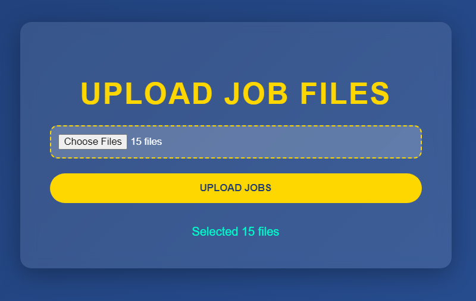

# API Development

API Development project for extracting text from job descriptions (PDF/DOCX) and CVs (PNG) using Flask, with advanced analysis features including LLM semantic analysis and similarity metrics and translation.
## Features

- `/upload-jobs`: Extract text from up to 20 PDF and 20 DOCX job description files.
- `/upload-cv`: Extract qualifications, skills, and experience from a juriste's CV in PNG format.
- `/view-data`: Retrieve all stored job descriptions and CVs from the database.
- `/analyze-jobs`: Analyze job descriptions for word frequency and basic statistics.
- `/view-analysis`: Serve the word frequency visualization.
- `/analyze-llm`: Perform semantic analysis on CV data using a pre-trained LLM (Google Gemini) to extract skills, experiences, and qualifications.
- `/calculate-similarities`: Calculate Cosine Similarity, Levenshtein Distance, and Jaccard Index between a job description and CV.
- `/translate-to-english`: Translate a job description to English, using text from `JOB_TEXT_FOR_TRANSLATION` in `.env` or a database ID via query parameter.

## Prerequisites

- Python 3.10
- Tesseract OCR (ensure it's in your system PATH)
- PostgreSQL (configured and running locally or remotely)

## Installation

1. Clone the repository:
   ```bash
   git clone https://github.com/semahkadri/API-development.git
   cd API-development
   ```

2. Create and activate a virtual environment:
   ```bash
   python -m venv venv
   .\venv\Scripts\activate
   ```

3. Install dependencies:
   ```bash
   pip install -r requirements.txt
   ```

## Running the App

1. Navigate to the project folder:
   ```bash
   cd project
   ```

2. Run the Flask app:
   ```bash
   python app.py
   ```

3. Access the endpoints:
   - Jobs Form: `http://127.0.0.1:5000/upload-jobs-form`
   - CV Form: `http://127.0.0.1:5000/upload-cv-form`
   - View Data: `GET http://127.0.0.1:5000/view-data`
   - Analyze Jobs: `GET http://127.0.0.1:5000/analyze-jobs`
   - View Analysis: `GET http://127.0.0.1:5000/view-analysis`
   - Analyze with LLM: `GET http://127.0.0.1:5000/analyze-llm`
   - Calculate Similarities: `GET http://127.0.0.1:5000/calculate-similarities`
   - Translate to English: `GET http://127.0.0.1:5000/translate-to-english`

## Usage

- **Upload Jobs**: Use the form at `/upload-jobs-form` to upload up to 20 PDF and 20 DOCX job description files. Returns a JSON response with extracted text.
- **Upload CV**: Use the form at `/upload-cv-form` to upload a PNG CV. Returns a JSON response with extracted qualifications, skills, and experience.
- **View Data**: Send a GET request to `/view-data` to retrieve all stored jobs and CVs as JSON.
- **Analyze Jobs**: Send a GET request to `/analyze-jobs` to analyze job descriptions, returning word frequencies and statistics (total documents, total words, unique words, average words per document) along with a visualization path.
- **View Analysis**: Access `/view-analysis` to view the Plotly bar plot of word frequencies in your browser.
- **Analyze with LLM**: Send a GET request to `/analyze-llm` to perform semantic analysis on a specific CV using Google Gemini, returning extracted skills, experiences, and qualifications.
- **Calculate Similarities**: Send a GET request to `/calculate-similarities` to compute Cosine Similarity, Levenshtein Distance, and Jaccard Index between a job description and CV.
- Translate to English: Send a GET request to `/translate-to-english` to translate the job description specified in `JOB_TEXT_FOR_TRANSLATION` from `.env`.

## Screenshots

### Upload CV Form


### Upload Jobs Form


## Project Structure

- `project/app.py`: Main Flask application entry point.
- `project/config.py`: Configuration settings and dependencies setup.
- `project/routes.py`: API route definitions.
- `project/utils/`: Utility modules for file handling and text extraction.
  - `file_handler.py`: File saving and cleanup logic.
  - `pdf_extractor.py`: PDF text extraction.
  - `docx_extractor.py`: DOCX text extraction.
  - `cv_processor.py`: PNG OCR and CV parsing.
  - `data_analyzer.py`: Text analysis and Plotly visualization generation.
  - `llm_analyzer.py`: LLM-based semantic analysis using Google Gemini.
  - `similarity_calculator.py`: Calculations for Cosine Similarity, Levenshtein Distance, and Jaccard Index.
  - `translator.py`: Translation of job descriptions to English.
- `project/db/`: Database-related modules.
  - `database.py`: Database operations for storing and retrieving data.
  - `models.py`: SQLAlchemy models for job descriptions and CVs.
- `project/static/`: HTML forms for job and CV uploads.
  - `upload_cv.html`: Form for CV uploads.
  - `upload_jobs.html`: Form for job.
  - `style.css`: Add more styles.
- `notebooks/`: Jupyter notebooks for experiments.
  - `PDF_DOCX_Extraction.ipynb`: Experiments for PDF/DOCX extraction.
  - `CV_Extraction.ipynb`: Experiments for CV extraction. 
  - `Database_Dump.ipynb`: Experiments for database storage.
  - `Data_Analysis.ipynb`: Experiments for job description analysis.
  - `LLM_Analysis.ipynb`: Experiments for LLM analysis.
  - `Similarity_Calculation_API`: Experiments for similarity calculation API.
  - `Translation_API_Test.ipynb`: Experiments for translation API.

## Requirements
See `requirements.txt`. Key dependencies include:

- `Flask` and `Flask-SQLAlchemy` for the web framework and ORM.
- `psycopg2-binary` for PostgreSQL connectivity.
- `pytesseract`, `pdfplumber`, `python-docx`, `nltk`, and `Pillow` for text extraction and processing.
- `python-dotenv` for loading environment variables from `.env`.
- `plotly` for data visualization.
- `google-generativeai` for LLM analysis with Google Gemini.
- `deep-translator` for translating job descriptions to English.

## Notes

- The `uploads/` folder is used temporarily during runtime and is excluded from the repository via `.gitignore`.
- Ensure test files (PDF, DOCX, PNG) contain readable text for accurate extraction.
- Sensitive data (e.g., database URI) is now stored in a `.env` file, making the codebase safe.
- The LLM analysis requires a valid Google Gemini API key to be set in the `.env` file as `GEMINI_API_KEY`.
- The `/calculate-similarities` endpoint requires valid `job_id` and `cv_id` parameters matching database entries.
- The `/translate-to-english` endpoint uses `JOB_TEXT_FOR_TRANSLATION `from `.env` by default.
